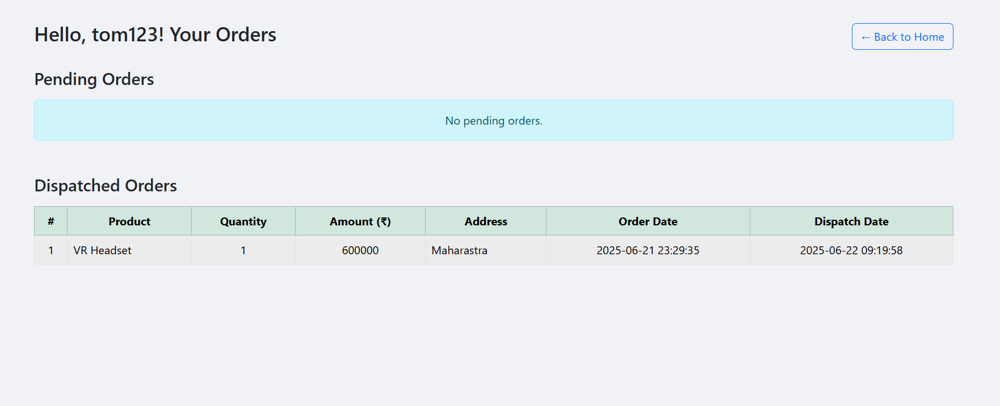
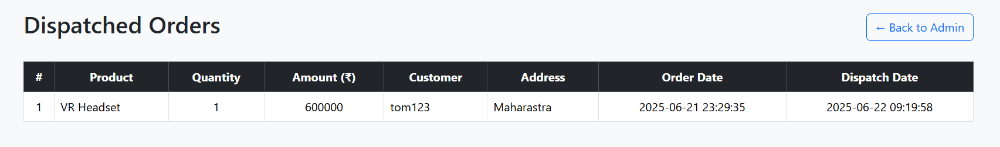

# E-commerce-site
e-commerce site with PHP and Mysql

## Features

- Register & Login system (Session-based authentication)
- View product listings with images and categories
- Filter products by category
- View detailed product information
- Place an order (Buy Now functionality)
- View order history and dispatched status

## Admin Features
- Total number of products
- Total orders placed
- Total dispatches completed
- Total revenue from dispatched orders
- Add and view products
- View all orders
- Dispatch orders (moves data from `orders` table to `dispatch` table with timestamp)
- View dispatched order records

## ScreenShots

